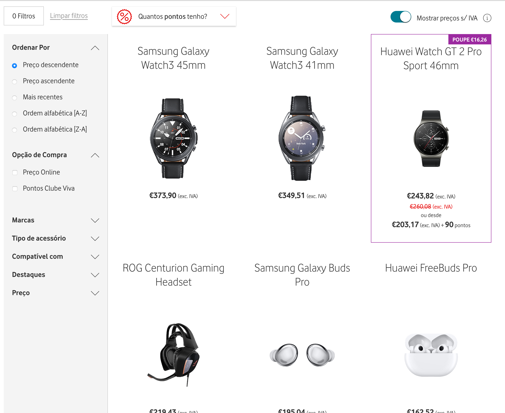
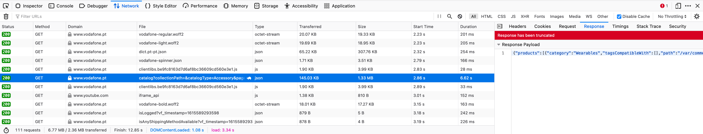
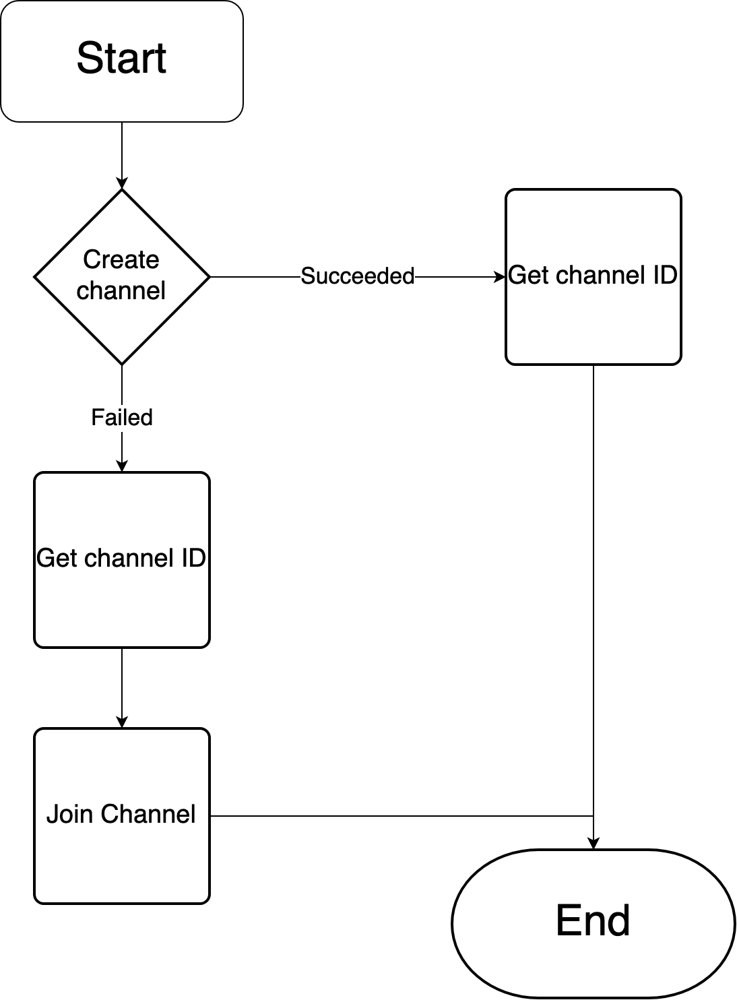
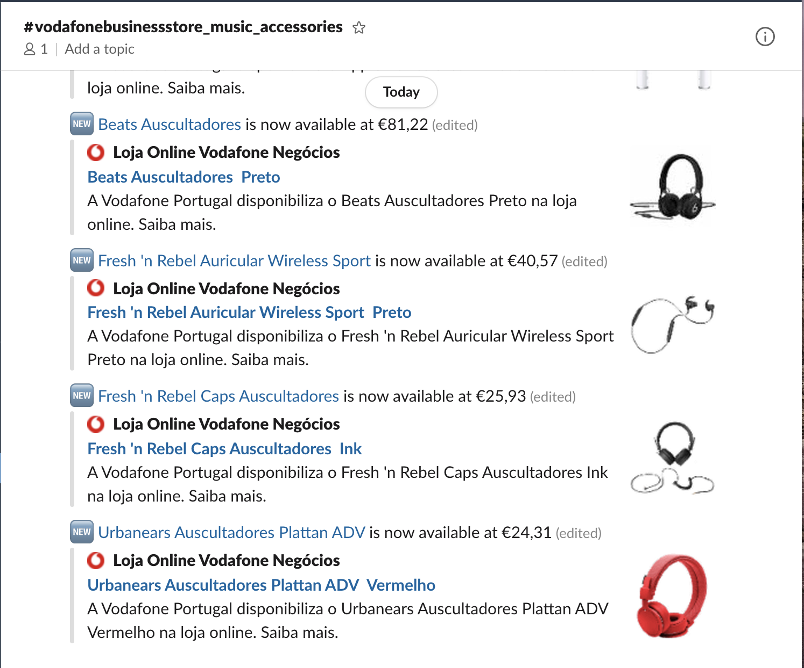
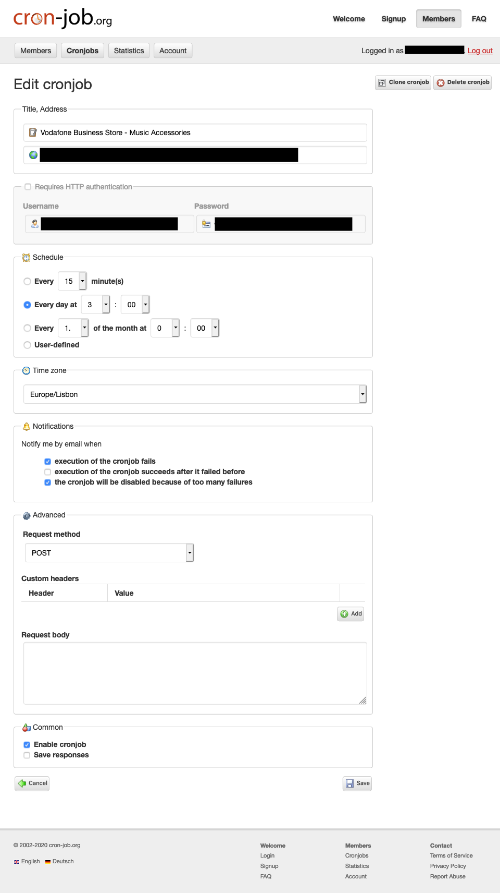

# :spider: Vodafone Business Store Scraper

Python project that crawls the Vodafone Business Store and notifies when a new product has been published.

You can most likely change the start URL and it'll work for other pages from the Vodafone Store. I did not test, so take it with a grain of salt.

This project can definitely be adapted for other pages. Continue reading for more information.

One final point, this project is currently deployed and running on Heroku.

## Motivation

I have some credit laying around in the Vodafone Business Store. While checking it, there was not much that got my attention, but I heard good stuff about the Apple AirPods Pro. At the time, they weren't available. Trust me, [I even asked it](https://forum.vodafone.pt/t5/Outros-Equipamentos/Disponibilidade-dos-AirPods-Pro-na-Loja-Online-Neg%C3%B3cios/m-p/374280). The answer was along the lines of _keep checking out_.

Not happy with the answer, and also because their products page took so much time to load (something like 1.5 seconds), I decided to automate this search. Besides, I ~~am~~ was bored due to the pandemic and this was an easy decision.

This project is overly complex for what it does, and that is a good thing as I practiced some skills, learnt new stuff and built my first scraper.

There are a lot of logs that were more useful than I am proud to say, factories and a pool (I'm talking about design patterns), a database, a Slack bot, a cloud provider and a cronjob. All these are glued together to provide a good solution to go shopping.

Now, I just need to keep an eye on [Slack](#notifier-slack) and have a [cronjob](#cronjob) triggering [Heroku](#heroku) to run this project every day at 3 a.m.. All this without paying anything!

## Requirements

Python 3. All the required dependencies are located on [requirements.txt](requirements.txt).

Regarding the required configurations, they are passed as environment variables. [Head to that section](#environment-variables) for more information.

## Environment Variables

 - `DATABASE_URL`: only required if you need the step to save on the database. It should be the database URI. The list of supported vendors is at [src/databases/databasefactory.py](src/databases/databasefactory.py).
 - `NOTIFIER`: the kind of notifier to publish about new products. The notifier also publishes about important warnings and errors that occurred and, because of that, it is required. The list of supported notifiers is at [src/notifiers/notifierfactory.py](src/notifiers/notifierfactory.py).
 - `SLACK_TOKEN`: Slack token with the necessary permissions.
 - `SLACK_CHANNEL`: Slack channel's name. Does not need to exist, but if it does, it should not be archived.
 - `PORT`: port for the HTTP server. Ignore it if you don't use the server.

## Running

On the root of the repository:
```
python3 src/server.py
```

If you find an error like:
```
Traceback (most recent call last):
  File "src/server.py", line 4, in <module>
    from src.environmentvariables import EnvironmentVariables
ModuleNotFoundError: No module named 'src'
```

Then you need to set the environment variable `PYTHONPATH` to `.`.

Now that the app is running, it started an HTTP server and by sending a POST request to `/scrape`, you'll trigger the scraper. To understand why have an HTTP server, read the [Heroku section](#heroku).

You can skip the server altogether by instead just calling the method [`Scraper().scrape()`](src/scraper.py).

## Vodafone Business Store

> Side note: Initial version required scrapping an HTML response. You can navigate through git history to get a better picture why [Scrapy](https://scrapy.org/) was chosen. The description below was adapted from Vodafone API changes and it reflects the current implementation.

You can access it [here](https://www.vodafone.pt/loja/acessorios.html?segment=business) (in Portuguese). As you can see, there is a section with the products:



If you opened the webpage (and you waited for it to load completely...), you'll there is an endpoint that returns a JSON object with all the products. Bloat free and everything we need. see that the page is not very scraper friendly. The products are loaded with JavaScript. However, by inspecting the queries we can get a [bloat free listing with no JavaScript required](https://www.vodafone.pt/bin/mvc.do/eshop/catalogs/catalog?collectionPath=&catalogType=Accessory&pageModel=%2Floja%2Facessorios.html&filterCatalog=true):



That single request is a whopping 1.33MB uncompressed that took 6.62ms. This might be painful for the visitors, but not problematic for a scraper. So, we can stick with it.

## Product

A [product](src/domain/product.py) is represented by its name (assumed to be unique), price and URL. The URL comes in handy as Slack will load the previews of the URL which show the product image.

## Scraper Pipeline


These steps are defined in the [scraper settings](src/scraper.py).

The spider represents the crawler that paginates each page of products and scrapes information about each product and builds a representation using a [domain object](src/domain/product.py).

Each step transition represents the traversal of products.

The check mark represents the validation of the product to ensure the spider got the right information. If the product is valid, then it continues.

The duplicate icon ensures that the spider didn't get the same product multiple times on the same execution. This means either the spider got things wrong, or the webpage is presenting duplicates. If the product has not been seen in this execution, then it continues.

The elephant represents a PostgreSQL database that stores the products (there is a [section to read more about it](#database-postgresql)). If a product exists, then its price is updated, otherwise it is inserted. Only new products continue.

The hashtag represents Slack and it is the notifier used. Besides alerting about application warnings and errors, it also alerts about the products that managed to get to it. Every product continues the pipeline.

All these steps are optional and their order can be changed with no restrictions.

## Database (PostgreSQL)

PostgreSQL has been chosen because Heroku has it out-of-the-box. Besides, it is well maintained, very well documented, has a great community and a lot of Stack Overflow answers that bootstrap the development by 10x (I'm exaggerating, obviously).

### Schema

```sql
create table if not exists vodafone.products(
            id          serial not null constraint products_pk primary key,
            created_at  TIMESTAMP default CURRENT_TIMESTAMP,
            name        text   not null,
            price       text   not null,
            url         text   not null);

create unique index if not exists products_name_uindex on vodafone.products (name);
```

The columns `name`, `price` and `url` are from [product](#product). All these fields are `text`, but have no need. I could have limited the size, but for what? Performance here is clearly not a problem (scale is very small) and keeping it flexible may give me some free room in the future.

`id` is there because names can change.

`created_at` provides neat data about when it was created.

### Queries

Because this usecase is so simple, only two queries inside a single transaction for each product are ever made:

```sql
SELECT EXISTS(SELECT 1 from vodafone.products WHERE name=%(name)s);

INSERT INTO vodafone.products (name, price, url) VALUES (%(name)s, %(price)s, %(url)s)
ON CONFLICT (name) DO UPDATE SET price=%(price)s;
```

The first query checks if the product existed. The second inserts the product, or updates its price if it exists.

## Notifier (Slack)

Slack initialization goes through a somewhat complex flow to get to a valid state. The following diagram should be intuitive enough to understand:



Once the flow ends, the notifier is on a valid state and ready to shoot warning and error messages to help catch application errors. However, its main usage is to notify about new products:



In order to have Slack fully working, it should have the following permissions:
 - https://api.slack.com/methods/conversations.create
 - https://api.slack.com/methods/conversations.list
 - https://api.slack.com/methods/conversations.join
 - https://api.slack.com/methods/chat.postMessage

Because Slack is also a hub for application warnings and errors, it is recommended to set up a Slackbot reminder to check if everything is ok. If you don't receive any messages for 1 month (just as an example), then most likely something happened that may require your attention.

## Heroku

Heroku, a cloud platform as a service, plays really well. Attach it a PostgreSQL database and you're good to go (besides, it sets the environment variable `DATABASE_URL` for you). Logging support works out of the box. I'm currently using a free tier which does come with some restrictions, but I found out they are more than enough for this use case.

Heroku also sets the environment variable `PORT`.

Having this application deployed is also the main reason to have an HTTP server, but for local development is not necessary. The server allows the application to be triggered due to external factors like a [cronjob](#cronjob).

Heroku also allows to have the application running 24/7 without any expenses. That's one other reason why Heroku is so important.

## Cronjob

With the application deployed, it just leaves to [set up a cronjob](https://cron-job.org):



It runs every day at 3 a.m. and notifies me if something goes wrong. Notice, that the request may succeed and the application still break, because a request succeeds before the scraping process starts.
